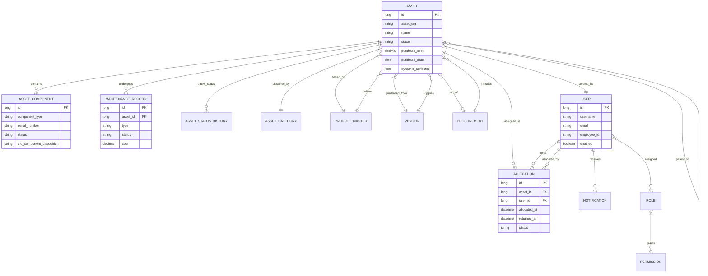

# Asset Management System - Entity Relationship Diagram

The following diagram illustrates the core database schema for the Asset Management System. The architecture centers around the **Asset** entity, which connects to classification, acquisition, assignment, and maintenance modules.

## Key Relationships

### Asset Lifecycle
- **Self-Join**: Assets can have a parent-child relationship (e.g., a Laptop as a parent to a Monitor or Docking Station).
- **Components**: Tracks modular parts (RAM, Battery) that can be replaced or disposed of.
- **Status History**: Every change in an asset's availability is logged for audit purposes.

### Resource Allocation
- **Allocation**: Acts as a join table between `Asset` and `User`, tracking who currently holds the asset and the historical chain of custody.

### RBAC (Role-Based Access Control)
- **User-Role-Permission**: A standard many-to-many relationship that defines granular access to system features (e.g., an Admin can replace components, while a Viewer can only see details).
